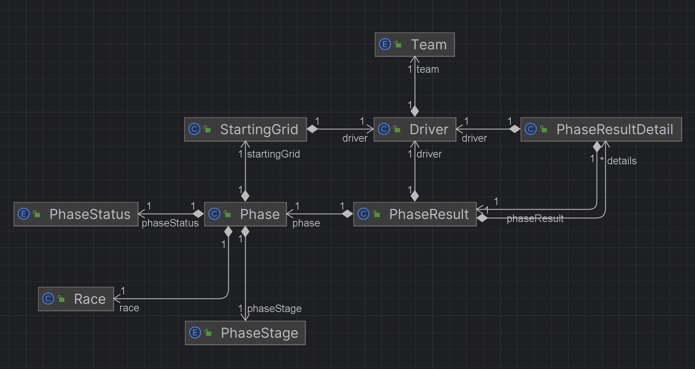

# Análisis

## Entendimiento del modelo

De lo explicado en la explicación del caso bajo análisis, podemos determinar que la formula 1 se compone de una serie de
carreras (Race) que se dan durante una temporada. Por cada carrera hay una serie de fases (Phase) que se dan durante cada 
fin de semana. Las fases de cada carrera son:
- **La Fase de práctica** donde los pilotos hacen un reconocimiento de la pista. (esta fase no aplica en términos de clasificación). 
- **La fase de clasificación** que se divide en 3 (Q1, Q2 y Q3); el objetivo de esta fase es **determinar cual será el orden 
en el que largarán los pilotos en la carrera principal.** (PhaseStage = Q1, Q2, Q3)
- **La carrera principal** que es la carrera en sí. (PhaseStage = R)

## Modelo de clases

Podemos identificar las siguientes clases de negocio:

- Carrera (Race): Es cada una de las fechas que se corren durante una temporada.
- Equipo (Team): Cada uno de los 10 equipos que compiten en la Formula 1.
- Piloto (Driver): Cada uno de los pilotos que poseen los equipos. Cada equipo tiene 2 pilotos.
- Fase de la carrera (Phase): Cada una de las fases de una carrera, estas son la fase de práctica, clasificación y 
carrera principal.
- Grilla de salida (StartingGrid): La grilla de salida de la fase. Solo aplica a la carrera principal.
- Resultado de la fase (PhaseResult): El resultado final que se obtuvo por cada piloto en la fase, 
es decir la posición final que ocupa al final de la fase de acuerdo al mejor tiempo que haya hecho.
- Detalle de la fase (PhaseResultDetail): Cada una de las vueltas que da un piloto y en las que registra un tiempo
para definir cuál es su mejor tiempo.

Con este detalle podemos determinar que cada fase (Phase) tiene un resultado (PhaseResult) y que cada resultado tiene 
una lista de cada registro de vuelta de los pilotos (PhaseResultDetail).

  

## Modelo de datos

Dado que solo nos piden manejar el cálculo de las posiciones de los pilotos en la clasificación, podemos definir
que solo necesitamos las siguientes tablas:

- races (RaceEntity): Contiene la información de cada carrera.
- drivers (DriverEntity): Contiene la información de cada piloto.
- phases (PhaseEntity): Contiene la información de cada fase de la carrera.
- starting_grids (StartingGridEntity): Contiene la información de la grilla de salida de cada fase.
- phase_results (PhaseResultEntity): Contiene la información de los resultados de cada fase.
- phase_result_details (PhaseResultDetailEntity): Contiene la información de cada registro de vuelta de los pilotos.

A los fines prácticos de simplificar el modelo, los equipos (team) y las etapas de las fases (phase stages) fueron
declaradas como enumerators.

  

## Secuencias de operaciones

#### 1. Crear una API que permita crear, abrir y cerrar sesiones de clasificación con los pilotos que participan en la sesión.

##### Crear y abrir una sesión de clasificación

