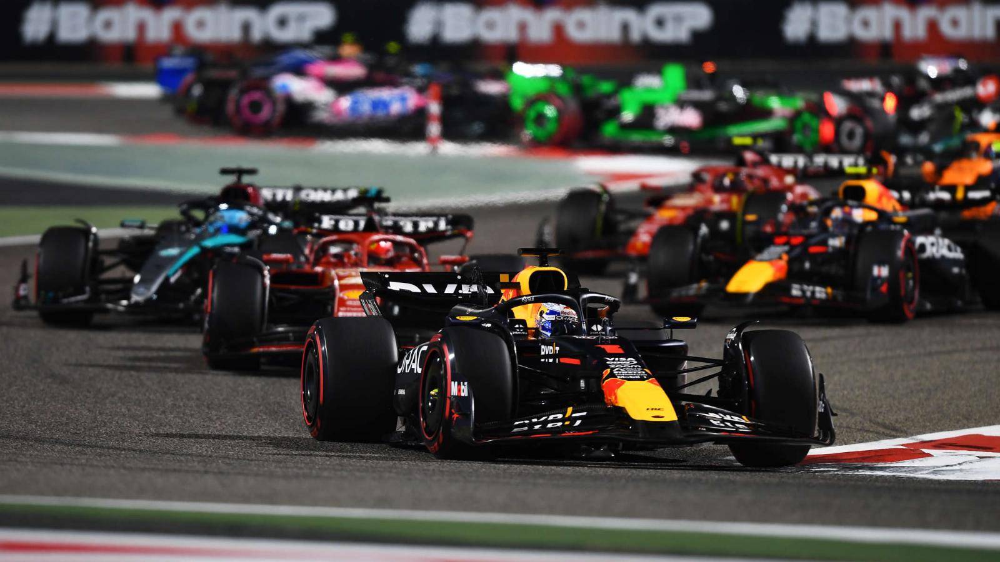
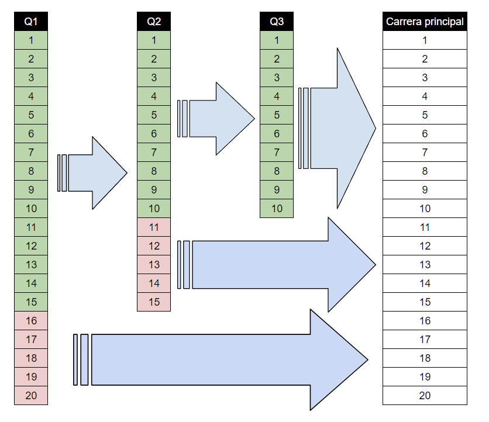
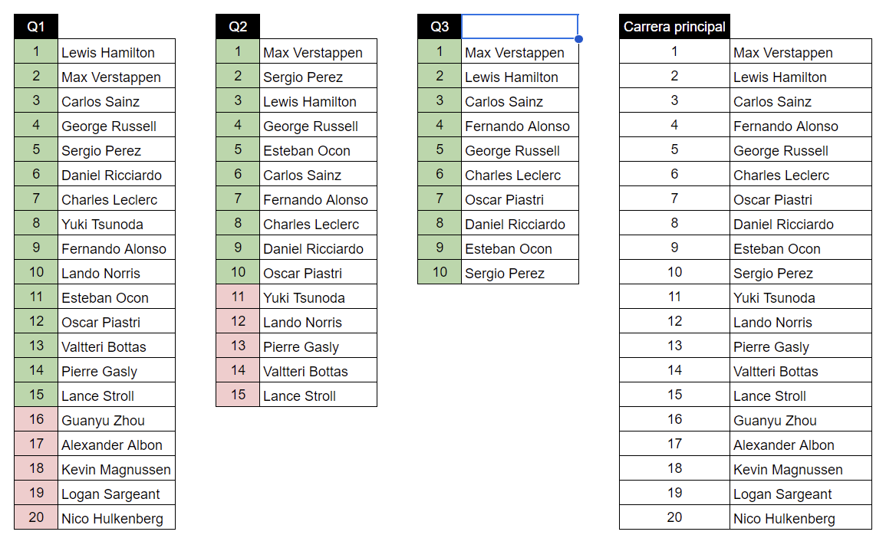

  

# Examen - Formula 1

## Contexto sobre la F1

### ¿Qué es la Fórmula 1?

La Fórmula 1 es la cúspide del automovilismo y la categoría más alta de las carreras de monoplazas. 
La F1 compite con coches de ruedas abiertas (es decir, fuera del cuerpo principal del vehículo), tanto en circuitos 
permanentes como en circuitos urbanos.

La F1 tiene una estructura de competición en la que **participan 10 equipos**, con **dos pilotos por equipo**. 
Se trata de un formato de tabla de clasificación, en el que se acumulan puntos a lo largo de la temporada (más adelante 
se hablará de ello).

El campeonato mundial se fundó en 1950 y está regulado por la FIA, que establece las normas y reglamentos. Este deporte 
es único, ya que los equipos construyen sus propios coches cada año, siguiendo las normas y reglamentos establecidos por 
la FIA. Con frecuencia crean monoplazas con una gran velocidad en las curvas. Por término medio, los coches de F1 
alcanzan una velocidad máxima de más de 320 km/h en las rectas.

A lo largo de sus 70 años de historia, la Fórmula 1 ha tenido fama de ser un deporte peligroso, en el que los pilotos se 
juegan la vida en las carreras. En las últimas décadas, la seguridad ha mejorado drásticamente con modificaciones en 
los coches -como el halo sobre la cabina- para proteger a los pilotos.

### ¿Qué ocurre durante un fin de semana de carrera en la Fórmula 1?

Un fin de semana de carreras tiene lugar de viernes a domingo. El fin de semana consta de tres sesiones de entrenamientos 
libres de una hora de duración; dos son el viernes (FP1 y FP2), y la otra es el sábado por la mañana (FP3). El sábado por 
la tarde se disputa la clasificación dividida en tres sesiones. Así se forma la parrilla de salida para la carrera del 
domingo, con el formato que se detalla a continuación.

La carrera es el evento principal del fin de semana, y es el momento en el que se entregan los puntos a los equipos y 
pilotos. Los pilotos compiten entre sí alrededor del circuito durante 190 millas (305 km.), normalmente a lo largo de 
dos horas, pero la carrera puede durar hasta cuatro horas en función de las banderas rojas (es decir, la necesidad de 
suspender la carrera debido a un accidente).

La carrera presenta elementos de estrategia, con paradas en boxes y gestión del combustible a tener en cuenta. Los 
incidentes también tienen un gran impacto, ya que provocan la aparición de coches de seguridad que ingresan a la pista 
y coches de seguridad virtuales (sin vehículo físico, pero no se puede adelantar y la velocidad está limitada).

Los fines de semana con carrera sprint sufren algunas modificaciones, explicadas a continuación.

### ¿Cómo funciona la clasificación de la F1?

La clasificación se utiliza para determinar las posiciones de la parrilla de salida para la carrera del domingo y 
tradicionalmente tiene lugar un sábado, o un viernes por la tarde durante los fines de semana sprint (que se detallan a 
continuación en esta guía).

La sesión se divide en tres partes. En la **Q1** todos los pilotos salen a la pista para marcar **el tiempo de vuelta más 
rápido posible en 18 minutos. Los cinco pilotos más lentos son eliminados de la sesión y comenzarán la carrera desde su 
posición final.** En la Q2 se repite el proceso, pero con 15 pilotos y en 15 minutos.

**Los 10 primeros de la Q2 pasan a la Q3**, en la que luchan por la pole position en una sesión de 12 minutos. 
El tiempo más rápido obtiene la pole y comenzará la carrera del domingo en primer lugar. Los puestos segundo a décimo 
se determinan por las siguientes vueltas más rápidas.

La clasificación durante un fin de semana sprint altera la estructura. La sesión tiene lugar el viernes por la tarde, 
sustituyendo a la FP2. Esos resultados determinan, desde 2023, la parrilla para el domingo. Durante 2021 y 2022, 
el orden de la grilla dominical se definía en la carrera sprint.

## Descripción del examen a resolver

En este examen se plantea la creación de un sistema de información para la gestión de la clasificación a la carrera del 
evento principal de un fin de semana en la Fórmula 1. Para esto, el sistema deberá ser capaz de registrar la información
de los pilotos durante la clasificación (en sus 3 etapas Q1, Q2 y Q3) y luego mostrar la parrilla de salida para la 
carrera del domingo. 

> El sistema ya cuenta con la información de los pilotos y sus equipos previamente cargada en una 
base de datos, solo se necesita registrar la información de los tiempos de carrera en la clasificación.

En sistema proveerá una API con que podrán crearse y abrirse las etapas de clasificación (Q1, Q2, Q3) con los pilotos
que la componen; luego, se podrán registrar los tiempos de vuelta de cada piloto en la etapa y finalmente se podrá 
cerrar la etapa. Cuando la etapa es cerrada, se calculan la posiciónes que obtuvo cada piloto en la etapa para ser 
usada para la creación de la etapa siguiente. Al finalizar las 3 etapas, se podrá consultar la parrilla de salida
para la carrera del domingo.

### Ejemplo de la clasificación

En el siguiente ejemplo se muestra como al finalizar la primera sesión de clasificación (Q1) los pilotos que obtuvieron 
los mejores 15 tiempos pasan a la siguiente sesión (Q2) y los últimos 5 pilotos quedan eliminados, por ende largan en 
los últimos puestos de la carrera del domingo. En la segunda sesión, los 10 mejores tiempos pasan a la última sesión
(Q3) y los 5 peores tiempos quedan eliminados y largan en ls posiciones del 11 al 15 en la carrera del domingo. 
Finalmente, en la última sesión (Q3) se determina el orden de largada para los 10 primeros puestos de la carrera del
domingo.

  

En la siguiente imagen se ve un ejemplo concreto de como funciona la clasificación a una carrera.
En el Q1, los pilotos "Guanyu Zhou", "Alexander Albon", "Kevin Magnussen", "Logan Sargeant" y "Nico Hulkenberg" terminaron
en las últimas posiciones y quedaron eliminados, pasando a la carrera del domingo en las posiciones 16 al 20.

Lo mismo se puede observar en la sesión Q2, donde los últimos 5 pilotos quedaron eliminados. Es importante notar que 
cada sesión es individual y no se acumulan los tiempos de vuelta de las sesiones anteriores. Si ven el ejemplo, verán 
que "Yuki Tsunoda" y "Lando Norris" habían terminado entre los 10 en Q1, pero fueron eliminados en Q2 sin la posibilidad
de pasar a la última sesión Q3.

  

## Requerimientos del sistema

1. Crear una API que permita registrar los tiempos de vuelta de los pilotos en una sesión de clasificación. Un piloto
   puede registrar un tiempo de vuelta por cada vuelta que da, es decir que registra mas de un tiempo por sesión, 
   pero solo se tomará en cuenta el mejor tiempo de vuelta registrado para el cálculo de la posición.
2. Completar el desde cero el método que arma las grillas de salida de las fases siguiente una vez que finaliza la fase actual.
3. Completar los Test de los 2 métodos trabajados durante el examen. La cobertura de los mismos debe ser de al menos 80%.

> **NOTA**: Se recomienda leer el código ya existente para entender como está estructurado el sistema y como se
> relacionan las clases entre sí.
 
> Los controladores ya se encuentran creados y solo se necesita implementar la lógica de negocio en los servicios, 
> las clases del modelo y los repositorios necesarios para dar cumplimiento a los requerimientos del sistema.